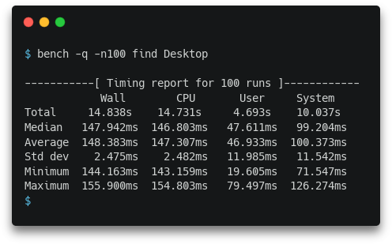

Minibench
=========

Minimalistic runtime benchmarking utility for Linux written in plain C99.

</img>

Design goals:

- Simple, concise, standard-conforming code.
- No external dependencies of any kind.
- Smallest possible overhead (within reasonable limits) for the timing code.
- Ability to perform warm-up runs before starting timed runs.
- Calculation of total, median, average, standard deviation, minimum and maximum
  of wall-clock time and CPU time, using an online algorithm where possible
  (i.e. for everything except median).
- Preservation of the exit status of the benchmarked program when possible.
- Ability to mute the benchmarked program's output (stdout and stderr).
- Human readable, pretty-printed output.

Building and installation
-------------------------

Minibench is designed to run on a Linux system, though it will probably also
compile and run on other Unix-like systems.

Use `make` to build, `make install` to install, and `make uninstall` to
uninstall. Installing will simply create a copy of the compiled `bench` binary
inside `~/.local/bin/`, so make sure that directory is in your `PATH`.

---

*Copyright &copy; 2022 Marco Bonelli. Licensed under the Apache License v2.0.*
